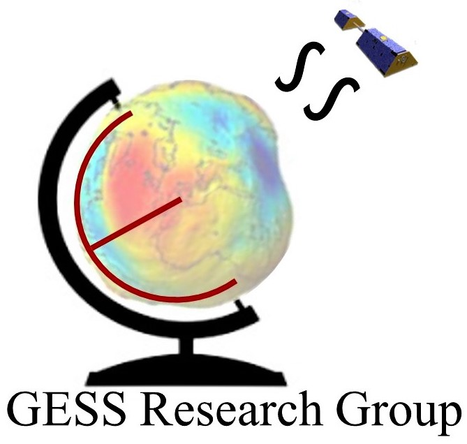

# PySHbundle: A Python implementation of GRACE Spherical Harmonics Synthesis MATLAB codes SHbundle <br>

 <br>

This package, `PySHbundle` provides tools to process GRACE data, such as, the computation of anomalies, substitution of poor quality low degree coefficients, reducing noise in GRACE data using filtering approaches, signal leakage correction using `GDDC`, etc. In addition, the package provides a flexibility for future development and addition of further processing choices for handling GRACE data for hydrological application.

PySHBundle is a tool to process GRACE L2 data and re-implements the popular [SHBundle](https://www.gis.uni-stuttgart.de/en/research/downloads/shbundle/) and [DataDrivenCorrection Bundle](https://www.gis.uni-stuttgart.de/en/research/downloads/datadrivencorrectionbundle/) tools originally written using MATLAB. 


## Usage
1. Read and Load level-2 spherical harmonic data
2. Create basin time series for TWS
3. Perform grace data driven correction
4. Plot spherical harmonic related plots

## 1. How to install <br>
### 1.1 For Users
The module can be installed via pip python package manager. Follow the follwing steps to setup a virtual environment and start exploring the GRACE Gravity Field data.

```shell
# clone the repository in order to access the notebooks and data
$ git clone https://github.com/lsmvivek/pyshbundle.git
$ pip install .


# The package is available on pip but is BROKEN
# Please avoid installing via pip till we fix that
# creating a new virtual environment
$ python3 -m venv <name-env>
# activate the virtual environment environment
$ source </location-of-virt-env/name-env/bin/activate>
# install package into virtual environment
$ pip install pyshbundle
```

### 1.2 For Devs/Contributors
Developers can access the latest development branch and 
```shell
# clone the repo and fetch the dev branch
$ git clone git@github.com:mn5hk/pyshbundle.git

# creating a new virtual environment
$ python3 -m venv <name-env>

# install the dependencies from the requirements-dev file
$ pip install -r ../pyshbundle/requirements-dev.txt

# activate the virtual environment environment
$ source </location-of-virt-env/name-env/bin/activate>

# install package into virtual environment
$ pip install ../pyshbundle/dist/<required-version>.tar.gz

# you also have the option to build the module using, be careful of 
$ python setup.py sdist
```

## Trying it out

Data for trying out this new tool is included in the repo. After installing and cloning the repo, go to the notebooks directory in order to find explainatory ipython jupyter notebooks. Simply activate the virtual environment and fire up these jupyter notebooks. Available notebooks:

1. Introduction to Spherical Harmonics
2. Loading the data
3. Visualizations
4. Terrestrial Water Storage (TWS) Time Series
5. Tests and Validation notebook


## Docs

Please find the docs here - [PySHBundle](https://gess-research-group.github.io/pyshbundle/)


## Contributing

Contributions are welcome, and they are greatly appreciated! Every
little bit helps, and credit will always be given.

You can contribute in many ways:

## Types of Contributions

### Report Bugs

Report bugs at [GitHub Issues](https://github.com/mn5hk/pyshbundle/issues)


If you are reporting a bug, please include:

-   Your operating system name and version.
-   Any details about your local setup that might be helpful in troubleshooting.
-   Detailed steps to reproduce the bug.

### Fix Bugs

Look through the GitHub issues for bugs. Anything tagged with `bug` and
`help wanted` is open to whoever wants to implement it.

### Implement Features

Look through the GitHub issues for features. Anything tagged with
`enhancement` and `help wanted` is open to whoever wants to implement it.

### Write Documentation

pyshbundle could always use more documentation,
whether as part of the official pyshbundle docs,
in docstrings, or even on the web in blog posts, articles, and such.

### Submit Feedback

The best way to send feedback is to file an issue at
[GitHub Issues](https://github.com/mn5hk/pyshbundle/issues)

If you are proposing a feature:

-   Explain in detail how it would work.
-   Keep the scope as narrow as possible, to make it easier to implement.
-   Remember that this is a volunteer-driven project, and that contributions are welcome :).

## License Statement

This file is part of PySHbundle. <br>
    PySHbundle is free software: you can redistribute it and/or modify<br>
    it under the terms of the GNU General Public License as published by<br>
    the Free Software Foundation, either version 3 of the License, or<br>
    (at your option) any later version.<br>
<br>
    This program is distributed in the hope that it will be useful,<br>
    but WITHOUT ANY WARRANTY; without even the implied warranty of<br>
    MERCHANTABILITY or FITNESS FOR A PARTICULAR PURPOSE.  See the<br>
    GNU General Public License for more details.<br>
<br>
    You should have received a copy of the GNU General Public License<br>
    along with this program.  If not, see <http://www.gnu.org/licenses/>.<br>
    

## Acknowledgement:
Please note that PySHbundle has adapted the following code packages,both licensed under GNU General Public License

  1. SHbundle: https://www.gis.uni-stuttgart.de/en/research/downloads/shbundle/ 
  2. Downscaling GRACE Total Water Storage Change using Partial Least Squares Regression: https://springernature.figshare.com/collections/downscaling_GRACE_Total_Water_Storage_Change_using_Partial_Least_Squares_Regression/5054564 


## Key Papers Referred:
 1. Vishwakarma, B. D., Horwath, M., Devaraju, B., Groh, A., & Sneeuw, N. (2017). 
    A data‐driven approach for repairing the hydrological catchment signal damage 
    due to filtering of GRACE products. Water Resources Research, 
    53(11), 9824-9844. https://doi.org/10.1002/2017WR021150 

 2. Vishwakarma, B. D., Zhang, J., & Sneeuw, N. (2021). 
    Downscaling GRACE total water storage change using 
    partial least squares regression. Scientific data, 8(1), 95.
    https://doi.org/10.1038/s41597-021-00862-6 
    

## How to Cite?
Coming soon!


## Follow the Research Group
<a href="https://ultra-pluto-7f6d1.netlify.app" rel="Geodesy for Earth system science (GESS) research Group at ICWaR, IISc">
    
</a>
