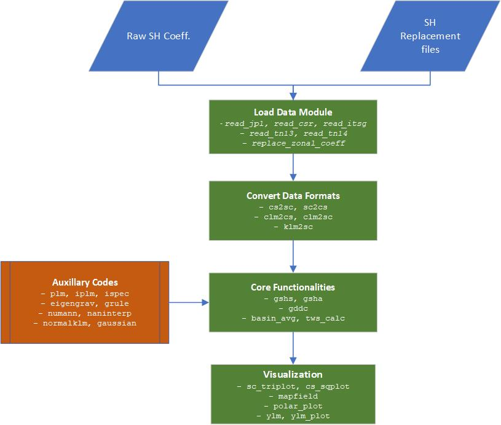

 
# Reference Mannual - PySHBundle

  The module codes can be categorized into four categories:

  + [Load Data Modules](load_data.md)
  + [convert data formats](convert_data_formats.md)
  + [core functionality](core_functionality.md)
  + [auxillary codes](auxillary_codes.md)

  

  Navigate the Reference Manual based on the following schematic