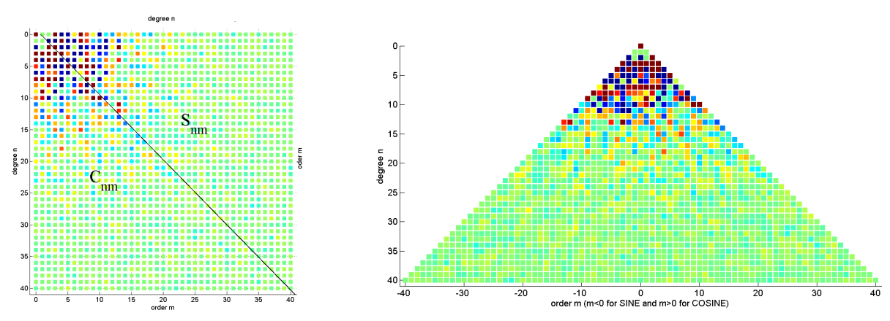

# Theoretical Background

## Mathematics

In this section, we present a mathematical representation of the spherical harmonics analysis. According to potential theory, the gravitational field of a body fulfils the Laplace equation $\nabla^2\phi = 0$. Laplace's equation in spherical coordinates can be written as follows: 

\begin{equation}
    \frac{1}{r^2}\frac{\partial}{\partial r}\bigg( r^2\frac{\partial \phi}{\partial r}\bigg)  
    +
    \frac{1}{r^2\sin\vartheta}\frac{\partial}{\partial \vartheta}\bigg(\sin\vartheta\frac{\partial \phi}{\partial \vartheta}\bigg) 
    +
    \frac{1}{r^2\sin^2\vartheta}\frac{\partial^2 \phi}{\partial \lambda^2}
    = 0 ,
\end{equation}

where 
$\phi$ is the potential, 
$r$ is the radius, 
$\vartheta$ is the co-latitude and 
$\lambda$ is the longitude. 

We perform a separation of variables and insert $\phi(r, \vartheta, \lambda) =f(r)g(\vartheta)h(\lambda)$ into the Laplace equation to get three independent equations:

\begin{equation}
r^2\frac{d^2f}{dr^2}+2r\frac{df}{dr} - n(n+1)f = 0,
\end{equation}

\begin{equation}
\frac{d^2g}{d\vartheta^2}
+
\frac{dg}{d\vartheta}\cot\vartheta
+
\bigg(  n(n+1) - \frac{m^2}{\sin^2\vartheta}   \bigg) g = 0 ,
\end{equation}

\begin{equation}
\frac{d^2h}{d\lambda^2} + m^2h = 0,
\end{equation}

where $m$ and $n$ are the degree and order respectively. Solving $(2), (3)$ and $(4)$, we obtain: 

\begin{equation}
f(r) \in \{r^n, r^{-(n+1)}\},
\end{equation}

\begin{equation}
g(\vartheta) \in \{P_{n,m}(\cos \vartheta), Q_{n,m}(\cos \vartheta)\} ,
\end{equation}

\begin{equation}
h(\lambda) \in \{\cos m\lambda, \sin m\lambda\}.
\end{equation}\\

Thus, the Laplace equation's solution takes the following form: 

\begin{equation}
\phi(r, \vartheta, \lambda) = \sum_{n=0}^{\infty} \sum_{m=0}^{n} 
\alpha_{n,m}
\begin{Bmatrix}
P_{n,m}(\cos\vartheta)\\
Q_{n,m}(\cos\vartheta)\\
\end{Bmatrix}
\dot{•}
\begin{Bmatrix}
\cos m\lambda\\
\sin m\lambda\\
\end{Bmatrix}
\dot{•}
\begin{Bmatrix}
r^n\\
r^{(n+1)}\\
\end{Bmatrix}
.
\end{equation}

Solutions for $f(r)$ and $h(\lambda)$ are fairly straightforward. Eq - (3) for $g(\vartheta)$ is in the form of a Legendre differential equation and its solutions are $P_{n,m}(\cos \vartheta)$ and $Q_{n,m}(\cos \vartheta)$, the associated Legendre functions of the first and second kind. We now apply two constraints to the solution:

* $\phi \rightarrow 0$ when $r \rightarrow \infty$,
* $\phi$ is limited on the sphere,

which leads us to eliminate $Q_{n,m}(\cos \vartheta)$ and $r^n$.The $4\pi$ normalization of the Associated Legendre functions [8] is utilized in our package and is given by: 

\begin{equation}
\bar{P}_{n,m}(\cos\vartheta) = P_{n,m}(\cos\vartheta)\sqrt{(2-\delta_{m0})(2n+1)\frac{(n-m)!}{(n+m)!}},
\end{equation}

where $\delta_{m0}$ is the Kronecker delta function,

\begin{equation}
P_{n,m}(t) = (1-t^2)^{\frac{m}{2}}\frac{d^mP_n(t)}{dt^m},
\end{equation}

and 

\begin{equation}
nP_n(t)=-(n-1)P_{n-2}(t) + (2n-1)tP_{n-1}(t).
\end{equation}

Spherical harmonics are the angular portion of a set of solutions to Laplace's equation. They take into account $\vartheta$ and $\lambda$. They are functions modelled on the surface of a sphere, denoted by $Y_{n,m}(\vartheta,\lambda)$. They are of three kinds: 

* Zonal harmonics: $m=0$ - they are only latitude dependent,
* Tesseral harmonics: $0 < m < n$, and 
* Sectorial harmonics: $m=n$.

Quantities like the gravitational potential, height of water column, gravity anomaly and so on are the functionals of the gravity field which are obtained by differentiating the potential $\phi$ with respect to the spherical coordinates. 

The gravitational potential anomaly $V$ is given by:

\begin{equation}
    V(r, \vartheta, \lambda) = 
    \frac{GM}{r} \sum_{n=0} ^{N_{max}} \sum_{m=0} ^{n} 
    \left(\frac{R}{r}\right) ^{n+1}
    \bar{P}_{n,m}(\cos \vartheta) [C_{n,m}\cos m\lambda+S_{n,m}\sin m\lambda].
\end{equation}

Here, $R$ refers to the radius of the Earth,
$\bar{P}_ {n,m}$ refers to the Associated Legendre functions with $4\pi$ normalization,
$C_{lm}$ and  $S_{lm}$ refer to the spherical harmonic coefficients. Similarly, another functional, the change in surface mass density, is represented by:

\begin{equation}
    \Delta\sigma(\vartheta, \lambda) = 
    \frac{a\rho_{ave}}{3} 
    \sum_{n=0}^{N_{max}}\sum_{m=0}^{n} 
    \left(\frac{R}{r}\right)^{n+1} 
    \bar{P}_{n,m}(\cos\vartheta)
    \frac{2n+1}{1+k_l}
    [C_{n,m}\cos m\lambda + S_{n,m}\sin m\lambda],
\end{equation}

where
$\rho_{ave}$ refers to the average density of the Earth in $g/cm^3$ and
$k_n$ refers to the load Love number of degree $n$.

## GRACE Data Levels

The `GRACE` data products are being developed, processed  and archieved in a shared Science Data System between the `Jet Propulsion Laboratory(JPL)`, the `University of Texas Center for Space Research (UT-CSR)` and `GeoForschungsZentrum Potsdam (GFZ)`.

+ Level 0: 
    The level-0 data are the result of the data reception, collection and decommutation by the Raw Data Center (RDC) of the Mission Operation System (MOS) located in Neustrelitz, Germany. The MOS receives twice per day using its Weilheim and Neustrelitz tracking antennae the science instrument and housekeeping data from each GRACE satellite which will be stored in two appropriate files in the level-0 rolling archive at DFD/Neustrelitz. The SDS retrieves these files and extracts and reformats the orresponding instrument and ancillary housekeeping data like GPS navigation solutions,space segment temperatures or thruster firing events. Level-0 products are available 24-hours after data reception.

+ Level 1: 
    The level-1 data are the preprocessed, time-tagged and normal-pointed instrument data. These are the K-band ranging, accelerometer, star camera and GPS data of both satellites. Additionally the preliminary orbits of both GRACE satellites will be generated. Level-1 data processing software is developed by JPL with support from GFZ (e.g. accelerometer data preprocessing). Processing of level-1 products is done primarily at JPL. An identical processing system (hardware/software) is installed at GFZ to serve as a backup system in case of hardware or network problems. This double implementation is necessary to guarantee the envisaged level-1 product delay of 5 days. All level-1 products are archived at JPL’s Physical Oceanography Distributed Active Data Center(PODAAC) and at GFZ’s Integrated System Data Center (ISDC) . Both archives are harmonized on a sub-daily timeframe.

+ Level 2: `Spherical Harmonic Coefficients` for the geopotential

    Level-2 data include the short term (30 days) and mean gravity field derived from calibrated and validated GRACE level-1 data products. This level also includes ancillary data sets (temperature and pressure fields, ocean bottom pressure, and hydrological data) which are necessary to eliminate time variabilities in gravity field solutions. Additionally the precise orbits of both GRACE satellites are generated. All level-2 products are archived at JPL’s PODAAC and at GFZs ISDC and are available 60 days after data taking. The level-2 processing software were developed independently by all three processing centres using already existing but completely independent software packages which were upgraded for GRACE specific tasks. Common data file interfaces guarantees a strong product validation. Routine processing is done at UTCSR and GFZ, while JPL only generate level-2 products at times for verification purposes.
    
+ Level 3: `Mascons` 
    consists of mass anomalies or other standardized products such as Monthly Ocean/Land Water Equivalent Thickness, Surface-Mass Anomaly. Similarly mass concentration blocks or `mascons` are also available.

+ Level 4: `Time Series` 
    Time-series of catchment level hydrological estimates of TWSA

`PySHBundle` provides the capability to obtain grided Total Water Storage Anomaly(TWSA) from Level 2 data.

Spherical harmonic functions or coefficients, Legendre functions and their derivatives can be arranged in different ways. There are multiple functions in SHBundle for reordering from one format to another. Some of them have been translated to Python in PySHBundle. Couple of new ones have also been added.

## Spherical Harmonics Data Formats

### clm-format

This is a standard format to store spherical harmonic coefficients in the indexed column-vector-format (abbreviatedL clm-format)

\begin{equation}
  \left( n, m, \overline{C}_{n, m}, \overline{S}_{n, m}, \left[ \sigma_{\overline{C}_{n, m}}, \sigma_{\overline{S}_{n, m}} \right] \right)
\end{equation}

The first column represents the degree $n$, the second column represents the order $m$ (both n,m are integers), followed by the coefficients $\overline{C}_{n, m}, \overline{S}_{n, m}$ and the last two columns contain their respective standard deviations $\sigma_{\overline{C}_{n, m}}, \sigma_{\overline{S}_{n, m}}$

### klm-format

This is a variation of the clm-format for compact notation with just 3 or 4 columns. The coefficients are sorted first w.r.t. degree and then the order, particularly the sine-coefficients are arranged starting first with negative orders. The following matrix represents the klm-format:

\begin{bmatrix}
    0 & 0 & \overline{C}_{0, 0} & \sigma_{\overline{C}_{0, 0}} \\
    0 & 0 & \overline{C}_{0, 0} & \sigma_{\overline{C}_{0, 0}} \\
    0 & 0 & \overline{C}_{0, 0} & \sigma_{\overline{C}_{0, 0}} \\ 
    0 & 0 & \overline{C}_{0, 0} & \sigma_{\overline{C}_{0, 0}} \\ 
    0 & 0 & \overline{C}_{0, 0} & \sigma_{\overline{C}_{0, 0}} \\ 
    0 & 0 & \overline{C}_{0, 0} & \sigma_{\overline{C}_{0, 0}} \\ 
    0 & 0 & \overline{C}_{0, 0} & \sigma_{\overline{C}_{0, 0}} \\ 
    0 & 0 & \overline{C}_{0, 0} & \sigma_{\overline{C}_{0, 0}} \\
    0 & 0 & \overline{C}_{0, 0} & \sigma_{\overline{C}_{0, 0}} \\ 
    \vdots & & & \vdots \\ N_{max} & N_{max} & \overline{C}_{N_{max}, N_{max}} & \sigma_{\overline{C}_{N_max}, N_{max}} \\
 \end{bmatrix}

### $\left | C \backslash S \right |$ format

This is another well known arrangement of Spherical Harmonic coefficients. This is a square matrix of size $n_{max}, n_{max}$.

The lower traingular terms are made of the cosine terms

### $\left / S | C \right \backslash$ format

This is yet another popular format where the sine-coefficients are flipped from left to right, to obtain a triangular arrangement which is completed by zeros.

The following figure illustrates the  $\left | C \backslash S \right |$ and  $\left / S | C \right \backslash$ format respectively.

