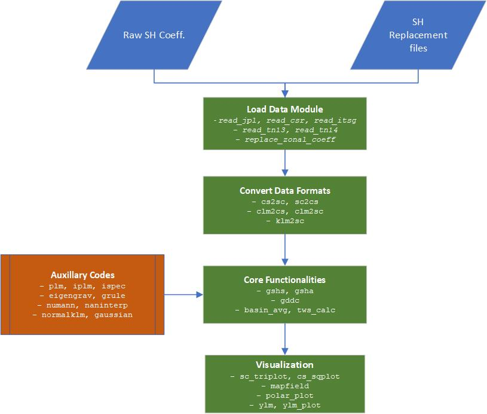

# Summary

`GRACE` (Gravity Recovery and Climate Experiment) satellite mission has been mapping mass changes near the surface of the Earth since 2002. Since mass redistribution at shorter temporal scales is dominated by hydrology, GRACE has transformed our understanding of changes in the hydrosphere. GRACE data has been used for monitoring and studying groundwater depletion, floods, droughts, etc. GRACE satellite products are typically released at various levels of complexity, often referred to as processing levels. Level 1 is the satellite instrument data that is processed to obtain Level 2 data: the spherical harmonic coefficients representing the mean monthly gravity field of the Earth. Level 2 are further processed to obtain level 3 products; gridded mass change estimates expressed as terrestrial water storage anomalies (`TWSA`). Level 2 data are unconstrained gravity field solutions and are noisy, which are filtered and corrected for known artifacts and signals from solid Earth processes to obtain level 3 products that are useful for hydrology. Processing choices, such as filter properties and type, have a significant impact on the accuracy and the resolution of final gridded output. Therefore, level 3 users must be cautious when using GRACE data for specific applications. Since, majority of the GRACE data user community is not well versed with level 2 data processing, they often use off the shelf product with doubts on the efficacy of GRACE mission. Here we developed an open-source GRACE level 2 processing toolbox to provide users with more control over processing choices. A python module, called PySHbundle, is developed that converts GRACE level 2 (`L2`) Spherical Harmonics data products to Level 3 (`L3`) `TWSA` products while applying the data-driven correction algorithm for reducing the impact of filtering on signal. With this contribution, we hope to enable further usage of GRACE data for Earth system science.

# Introduction

GRACE stands for the Gravity Recovery and Climate Experiment, a joint satellite mission by the National Aeronautics and Space Administration (`NASA`) in the USA, and the Geoforschung Zentrum (`GFZ`) in Germany. GRACE mission launced on 17 March, 2002, and ended on 27 October, 2017. Some details of the GRACE mission are provided in `Table 1`. GRACE has a successor, GRACE-FO, which was successfully launched on 22 May 2018 and is currently operational. GRACE consists of two identical satellites in the same orbit separated by approx. 220 km. The mission measures changes in the intersatellite distance with a microwave ranging system that gives an accuracy in the range of micrometers [@wahr1998time]. When the satellite system comes in the vicinity of a temporal mass anomaly, the relative intersatellite distance changes and it can be inverted to estimate the mass change near the surface of the Earth. Over the continental land surface, the hydrological processes are the major driver of the variation in mass anomaly at monthly to decadal scales. However various other signals such as oceanic and atmospheric variations, high frequency tidal mass changes, systemic correlated errors, etc. are also part of the obtained GRACE signals [@humphrey2023using]. Some of the unwanted signals, such as the high frequency tidal mass changes in the ocean and the atmosphere, are modelled and removed at level 1 processing `(Flechtner, 2007)`, while noise is still present at level 2 and it requires filtering [@wahr1998time; @vishwakarma2017understanding]. The choice of filter and/or subsequent steps to counter the signal loss due to filtering have an impact on the quality of GRACE products that are of interest to hydrologists `(Humphrey et al., 2023; Vishwakarma, 2020)`. The estimated hydrological signal is represented in terms of  `total water storage anomaly` (`TWSA`), which is the change in the water mass over a vertical column. Conventionally, it is represented in terms of `equivalent water height` (`m`).  

<i>Table 1: Summary of GRACE satellite mission [[source]](https://www2.csr.utexas.edu/grace/mission/mdetail.html)</i>

| Parameter        |    Details     | 
| --------------   |:--------------:| 
| Start of Mission | 17 March 2002  | 
| End of Mission   | 27 October 2017| 
| Altitude         | 485 km         |
| Intersatellite distance | ~ 220 km 
| Inclination      | 89.0°          | 
| Period           | 94.5 minutes   |  

Various research centers provide GRACE data, such as the University of Texas Center for Space Research (`CSR`), Jet Propulsion Laboratory (`JPL`), and the German Research Center for Geosciences (`GFZ`) and so on. `Level 2` data products are the spherical harmonic coefficients representing the mean monthly gravity field of the Earth. `Level 3` consists of gridded mass anomalies or other standardized products, such as the Monthly Ocean/Land Water Equivalent Thickness Surface-Mass Anomaly. Obtaining `level 3` products from `level 2` requires filtering that affects the signal quality and resolution, which is why another suite of products called mass concentration blocks or `mascons` are also available that are designed to take care of signal degradation due to filtering inherently. More details on the mascon approaches for studying gravity fields and the approaches used by the different data centers for generating mascon products may be referred to in `Antoni (2022)`. Mascon products from various centres differ due to the difference in the post-processing strategy used by these centres, which emphasizes that the processing choices have an impact of the gridded GRACE data. Processing `Level 2` data gives the user the freedom and the flexibility to explore GRACE data for a specific application over a specific region as per their convenience and belief.  

Converting spherical harmonic coefficients (`level 2`) to gridded field (`level 3`) is called spherical harmonic synthesis and vice-versa is spherical harmonic analysis. `Level 3` products may further be processed to obtain region-averaged timeseries data, labelled as `Level 4` products. Various tools exist to process GRACE data and to analyze it. Some of these are developed in the `MATLAB` programming language: [`SHbundle`](https://www.gis.uni-stuttgart.de/en/research/downloads/shbundle) (`Sneew et al., 2021`), [`GRACE Data Driven Correction`](https://www.gis.uni-stuttgart.de/en/research/downloads/datadrivencorrectionbundle) (`Vishwakarma et al., 2017`),  [`LUH-GRACE2018`](https://www.ife.uni-hannover.de/en/services/luh-grace) (`Koch et al., 2020`), [`GRAMAT`](https://link.springer.com/article/10.1007/s12145-018-0368-0) (`Feng, 2019`), [`SHADE`](https://www.sciencedirect.com/science/article/pii/S0098300418302760) (`Piretzidis and Sideris, 2018`), [`GRACETOOLS`](https://www.mdpi.com/2076-3263/8/9/350) (`Darbeheshti et al., 2018`), [`SSAS GRACE filter`](https://github.com/shuang-yi/SSAS-GRACE-filter)(`Yi & Sneeuw, 2022`), etc. Similarly, some GRACE data processing tools are also available based on the python programming language. These include [`gravity-toolkit`](https://gravity-toolkit.readthedocs.io/en/latest/) `(Sutterley, 2023)`, [`ggtools`](https://pypi.org/project/ggtools/1.1.0/) `(Li, 2020)` and [`GRACE-filter`](https://github.com/strawpants) `(Rietbroek, n.a.)`. General tools for spheric harmonic analysis are also available, such as [`SHTools`](https://agupubs.onlinelibrary.wiley.com/doi/full/10.1029/2018GC007529) (`Wieczorek & Meschede, 2018`). [`SHbundle`](https://www.gis.uni-stuttgart.de/en/research/downloads/shbundle) provide MATLAB scripts for `spheric harmonic synthesis` and `spheric harmonic analysis`. The first version of the code was developed in 1994 while the latest version with upgrades can be found dated 2018. [`GRAMAT`](https://link.springer.com/article/10.1007/s12145-018-0368-0) provides a similar MATLAB-based scripts for processing GRACE spherical harmonics data to obtain spatiotemporal global mass variations. The [`GRAMAT`](https://link.springer.com/article/10.1007/s12145-018-0368-0) toolbox includes Gaussian smoothening filter to reduce noise that appears strongly as North-South stripes, spherical harmonic analysis and synthesis routines, signal leakage reduction routines, harmonic analysis of times series over regions, and uncertainty analysis of GRACE estimates (`Feng, 2019`). [`SHADE`](https://www.sciencedirect.com/science/article/pii/S0098300418302760) provides a MATLAB-based toolbox for the empirical de-correlation of GRACE monthly spherical harmonics (`Piretzidis & Sideris, 2018`). [`Gravity-toolkit`](https://gravity-toolkit.readthedocs.io/en/latest/) is a python-based package meant to handle GRACE L2 data products. Its functionalities include visualization of GRACE and GRACE-FO L2 data products, and the estimation of GRACE and GRACE-FO L2 data product errors. [`Gg-tools`](https://pypi.org/project/ggtools/1.1.0/) too contain similar tools for signal correction and for conversion of GRACE L2 products to L3. `GRACE-filter` provides tool for filtering of GRACE L2 product using DDK filter based on `Kusche et al., (2009)`.
 
# Statement of need
A comprehensive MATLAB code bundle already exists called [`SHbundle`](https://www.gis.uni-stuttgart.de/en/research/downloads/shbundle) developed by `Sneew et al., (2021)` and distributed under the GNU license. The code bundle can be freely used and modified by anyone giving proper credit to the original developers. However, MATLAB being a proprietary software may have some limitations in terms of accessibility. 

On the other hand, a strong community of programmers also exists for Python, an open-source programming language. In this contribution, we have translated the MATLAB codes from the SHbundle into the Python programming language. In addition to the SHBundle codes, we have further translated the `GRACE Data Driven Correction (GDDC)` codes from MATLAB to Python. `GDDC` allows the correction of filtered GRACE `Level 2` products and restore the signal loss, independent of hydro-geophysical models `(Vishwakarma et al., 2017)`. 

Our package, `PySHbundle` has been developed in a modularized manner. The package provides tools to process GRACE data, such as, the computation of anomalies, substitution of poor quality low degree coefficients, reducing noise in GRACE data using filtering approaches, signal leakage correction using `GDDC`, etc. In addition, the package provides a flexibility for future development and addition of further processing choices for handling GRACE data for hydrological application.

It is hoped the contribution will make GRACE L2 data processing more accessible to a wider audience of young researchers. Our python package is titled `PySHbundle` and the working code can be accessed at [GitHub](https://github.com/mn5hk/pyshbundle).

# Mathematic Background

GRACE works on the principal of low-low inter-satellite distance tracking for space gravimetry. Gravitational potential function <i>V ( r, θ, λ )</i> can be represented by the spherical harmonic coefficients in the frequency domain with the help of the following relation `(Vishwakarma, 2017; Kaula, 1996; Chao & Gross, 1987; Wahr et al., 1998)`:

\begin{equation}
    V(r, \theta, \lambda) = 
    \frac{GM}{r} \sum_{l=0} ^ {\infty} 
    \left(\frac{a}{r}\right) ^ {l}
    \sum_{m=0} ^ {l} 
    \bar{P}_{l,m}(\cos \theta)[C_{l,m}\cos m\lambda+S_{l,m}\sin m\lambda],
\end{equation}

where <i>G</i> is the Gravitational constant, <i>M</i> represents the total Earth mass, <i>a</i> is the average radius of the Earth, <i>$P_{l,m}$</i>  represents the fully normalized Associated Legendre functions of the first kind, <i>$C_{l,m}$</i> and <i>$S_{l,m}$</i> represent the fully normalized spherical harmonic coefficients, and <i>l</i> and <i>m</i> represent the degree and order, respectively.

It should be noted that <i>equation 1</i> does not deal with the variability of gravimetric potential function over time. However, a major application of the GRACE satellite system is to retrieve the time-variable gravity information. To obtain time variability, a long-term mean of the spherical harmonic coefficients is removed from the monthly spherical harmonic fields and denoted by <i>$\Delta C_{l,m}$</i> and <i>$\Delta P_{l,m}$</i>. Thus, <i>equation 1</i> can be modified to obtain the change in gravimetric potential function over time.

Since we are interested in the water mass change, we need to obtain the change in density from the change in gravity potential function. It is further assumed that the redistribution of the mass of the Earth takes place within a thin layer close to the surface of the Earth. Furthermore, this mass redistribution results in solid Earth deformation that is accounted for by the load Love numbers <i>$k_l$</i> `(Wahr et al., 1998)`. After accounting for all these assumptions, approximations, and effects, <i>equation 1</i> further resolves to:

\begin{equation}
    \Delta \sigma (\theta, \lambda) = 
    \frac{a \rho_{avg}}{3} \sum_{l=0} ^ {\infty} 
    \sum_{m=0} ^ {l} Untitled
    \bar{P}_{l,m}(\cos \theta)
    \frac{2 l + 1}{1 + k_{l}}
    [\Delta C_{l,m}\cos m\lambda+ \Delta S_{l,m}\sin m\lambda].
\end{equation}

Here, <i>$\Delta \sigma (\theta, \lambda)$</i> represents the change in surface density of the Earth, and <i>$\rho_{avg}$</i> represents the average density of the Earth <I>$(5517 kg / m^3)$</i>. As the mass redistribution on Earth over a monthly time scale is dominated by the hydrological processes, the density change <i>$\Delta \sigma (\theta, \lambda)$</i> relates to the <i>Equivalent Water Height (EWH)</i> by <i>$\Delta \sigma (\theta, \lambda) = EWH (\theta, \lambda). \rho_{water}$</i>. Thus, <i>equation 2</i> can be rewritten in terms of <i>EWH</i> as:

\begin{equation}
    EWH (\theta, \lambda) = 
    \frac{a \rho_{avg}}{3 \rho_{water}} 
    \sum_{l, m}
    \bar{P}_{l,m}(\cos \theta)
    \frac{2 l + 1}{1 + k_{l}}
    [\Delta C_{l,m}\cos m\lambda+ \Delta S_{l,m}\sin m\lambda].
\end{equation}

We can estimate <i>EWH</i> from GRACE Level 2 data using <i>equation 3</i>. 

`Level 2` GRACE data products may be stored in various data formats. These include `|C\S|`, `/S|C\`, `clm`, `klm`, vector, and `Colombo` format (`Sneew et al., 2021`). In `|C\S|` format, the `Clm` and `Slm` coefficient are stored as lower triangle and upper triangle, respectively, in a matrix of dimension <i>$(l + 1) \times (l + 1)$</i>. In `/S|C\` format, the coefficients are stored in a matrix of dimension <i>$(l + 1) \times (2 l + 1)$</i> with a horizontally flipped triangular matrix of `Slm` coefficients on the left half, triangular matrix of `Clm` on the right half, and zeros on the rest of the matrix elements. The conversion between the three data formats is made possible with the modules `cs2sc`, `sc2cs`, `clm2sc`, `clm2cs`, and `klm2sc`. 

The accuracy and precision of the <i>EWH</i> computed depend on the accuracy and precision of the <i>$\Delta C_{l,m}$</i> and <i>$\Delta P_{l,m}$</i>, obtained from GRACE. A tradeoff exists between the noise and resolution of the spherical harmonic products `(Wahr et al., 1998; Devaraju and Sneew, 2016; Vishwakarma et al., 2018)`. For higher spatial resolution, higher degree and order coefficients are required. However, noise increases with the increase in degree and order, making the smaller scale features more noisy. Similarly, if the spherical harmonics are truncated at a lower degree and order, the noise in the computed <i>EWH</i> decreases along with the effective spatial resolution of <i>EWH</i> product.

To improve the signal-to-noise ratio of the obtained <i>EWH</i>, various filtering techniques have been used. An ideal filter retains all the signals while filtering out all the noise. A popular filter used for GRACE applications is the Gaussian filter. The weights, <i>w</i>, for the Gaussian spatial averaging are given by:

\begin{equation}
    \omega (\psi) = 
    \frac{\beta}{2 \pi} 
    \frac{exp [-\beta (1 - \cos \psi)]}{1 - \exp ^ {-2 \beta}},
\end{equation}

where, $\beta = \frac{\ln (2)}{(1 - \cos(\frac{r_{fil}}{a}))'}$. Here, $r_{fil}$ is the averaging radius of the filter. This Gaussian filter is applied to the GRACE fields in the spectral domain. The equation follows as `(Wahr et al., 1998)`:

\begin{equation}
\bar{\sigma}(\theta, \lambda) = 
\frac{2 a \rho_{avg} \pi}{3} 
    \sum_{l, m} W_l
    \bar{P}_{l,m}(\cos \theta)
    \frac{2 l + 1}{1 + k_{l}}
    [\Delta C_{l,m}\cos m\lambda+ \Delta S_{l,m}\sin m\lambda].
\end{equation}

<i>Equation 5</i> is similar to <i>equation 3</i>, but for an additional multiplication factor, <i>$W_l$</i>, defined as <i>$W_l = \int_0^\pi w (\psi) P_l (\cos \psi) \sin \psi d\psi$</i> and <i>$P_l = \frac{\bar{P_l}}{\sqrt {2l + 1}}$</i>. <i>Equation 5</i> defines a Gaussian filter that decays with only degree. However, for our GRACE spherical harmonics, the decay occurs with the location, degrees, and orders. Thus, <i>equation 5</i> is further generalized as `(Wahr et al., 1998; Devaraju, 2015)`:

\begin{equation}
\bar{\sigma}(\theta, \lambda) = 
\frac{a \rho_{avg}}{12 \pi} 
    \sum_{l, m}
    \sum_{n, k} W_{lm}^{nk}
    \bar{P}_{l,m}(\cos \theta)
    \frac{2 l + 1}{1 + k_{l}}
    [\Delta C_{l,m}\cos m\lambda+ \Delta S_{l,m}\sin m\lambda],
\end{equation}

where <i>$W_{lm}^{nk}$</i> represents the spectral weight in its general form. <i>Equation 6</i> is the final result we obtain after spectral harmonic synthesis and application of Gaussian filter. More details on the mathematical description presented in this section can be referred to in `Vishwakarma (2017)`.

# Methodology

In this contribution, tools to implement the spherical harmonic synthesis/ analysis and filtering application have been developed in the Python programming language. In addition, complementary analytical tools such as replacing poor quality spherical harmonic coefficients, computing anomalies from full fields, filtering, and applying data-driven correction approach to minimize signal damage due to filtering have also been included. To achieve this, we have translated the preexisting MATLAB codes `SHbundle` and `GRACE Data Driven Corrections` into the Python programming language. For more details on the `SHbundle` package please refer to `Sneew et al., 2021; Vishwakarma et al., 2017)` The naming of the modules and the workflow between the modules has been preserved as much as possible in the `PySHbundle` Python implementation. This ensures smooth communication between user communities of the two packages and/or the two different programming language communities. Further, our code has been tested using the `SHbundle` outputs as the benchmark.

# Implementation
A schematic diagram of the code workflow is presented in Fig 01. The module codes can be categorized into four categories: load data, convert data formats, core functionality, and auxiliary codes. The <i>load data</i> codes can read data from either of the `JPL`, `ITSG`, or `CSR` GRACE data centers. The codes further perform the necessary preprocessing, including the conversion of data formats, replacement of some Legendre coefficients as well as removing the long-term mean. The <i>convert data format</i> codes can convert `L2` GRACE Spherical Harmonics data from one format to another. These codes are invoked by the  <i>load data</i> codes for data format conversion. Further, these codes can be independently invoked as well by the user for their needs.

The `core functionalities` of the module are the `gsha`, `gshs`, `gddc`, `tws_cal`, and `basin_avg` codes. `GSHS` module inputs the GRACE L2 spherical harmonic coefficients and performs the `GRACE Spherical Harmonics Synthesis (GSHS)` algorithm. The algorithm converts the input L2 spherical harmonic coefficients into gridded values at the user-desired grid resolution. An inverse module is also provided, called the `gsha.py` module. This module performs the `GRACE Spherical Harmonics Analysis (GSHA)` algorithm. The algorithm converts the gridded `TWSA` values into the GRACE L2 spherical harmonics coefficients. In addition to the translation of the `SHbundle` MATLAB package, this contribution further includes the GRACE Data Driven Correction function, detailed and first coded in MATLAB by `Vishwakarma et al.,  (2017)`. The implementation is done via the `gddc` module. More details on the `gddc` implementation can be referred to in the paper cited above. `tws_cal ` computes the total water storage values at each grid from the GRACE L2 spherical harmonics by first applying the `Gaussian filter` on the L2 data products, and then calling the `gshs` module. `basin_avg` module computes the `L4` GRACE basin average time-series product, for any basin input by the user as a GIS shapefile.
 

 
<i>Fig 01: Schematic Diagram of the Code Workflow</i>

 

The rest of the codes are bundled together as <i>auxiliary codes</i> in Fig 01. An important part of the `GSHS` algorithm implementation is the implementation of the `PLM` algorithm. The `PLM` algorithm inputs degree, order, and co-latitude values and computes the output from normalized Legendre function of the first kind. The `plm.py` module can also provide the first and second derivatives of the Legendre functions. The implementation of the integrals of the Legendre functions is also done; this is available through the `iplm.py` module. `IPLM` inputs the degree, order and co-latitude, and returns the integrated Legendre functions. 

Some important modules for the spherical harmonic synthesis step are `normalklm`, `eigengrav`, and `ispec`. `normalklm.py` returns the hydrostatic equilibrium ellipsoid for the earth's surface based on `Lambeck (1988) "Geophysical Geodesy", p.18`. `eigengrav.py` provides the isotropic spectral transfer to obtain the equivalent water thickness (m). Lastly, `ispec.py` inputs the sine and cosine coefficients and returns the field function `F`.  

The `Global Spherical Harmonic Analysis` code depends upon `neumann` along with the `IPLM` and `sc2cs`. `neumann.py` returns the weights and nodes for Neumann's numerical integration scheme on the sphere. The `gshs.py` code provides options for spherical harmonic synthesis to compute the sine and cosine components of the Legendre function. These include `least squares`, `weighted least squares`, `approximate quadrature`, `first neumann method`, `second neumann method`, and `block mean values`. The `neumann.py` code is required for the implementation of the `first neumann method` and `second neumann method`. 

 

# Validation
The results of the PySHbundle TWSA computation have been validated with respect to TWSA computation using SHbundle and presented in Fig 02. We have chosen the Normalized Root Mean Square Error (`NRMSE`) metric for the validation.

\begin{equation}
NRMSE = 
\frac{\sqrt{\frac{\sum_{i=1}^{n}(TWSA_{pySH} - TWSA_{SH})^2}{n}}}
{\frac{\sum_{i=1}^{n} TWSA_{SH}}{n}}
\end{equation}

where: $n$ is the total number of timesteps; $TWSA_{pySH}$ is the TWSA for each timestep generated by PySHbundle; $TWSA_{SH}$ is the TWSA for each timestep generated by SHbundle

 
<i>Fig 02: NRMSE of TWSA computation for PySHbundle with respect to SHbundle results.</i> 

 
<i>Fig 03: Timeseries plot of TWSA signal from pyshbundle, shbundle and error signal for the Amazon basin</i> 

The `NRMSE` values are in the order of $e^{-8}$. Time-series plots for the Amazon and the Ganges basins have been plotted in Fig 03 and Fig 04, respectively. In both cases, the order of magnitude of the signal is $e^2$, while the error is in the order of $e^{-6}$. Thus, the Python package PySHbundle is deemed to give the desired performance in the processing of GRACE L2 Spherical Harmonics to obtain L3 TWSA anomalies over land grids.

 
<i>Fig 04: Timeseries plot of TWSA signal from pyshbundle, shbundle and error signal for the Ganges basin</i> 

# Concluding Remarks

In this paper, we have introduced a new Python software package named `PySHbundle`. The software can process Stokes coefficients for Earth's gravity field to provide gridded products representing changes in mass, geoid height anomalies, equivalent water height anomalies, etc. This package has been specially developed to process the level 2  spherical harmonic data from the GRACE satellite mission, which finds application in numerous disciplines of Earth system science. Many of the existing software packages for processing GRACE data, such as the [`SHbundle`](https://www.gis.uni-stuttgart.de/en/research/downloads/shbundle), [`LUH-GRACE`](https://www.ife.uni-hannover.de/en/services/luh-grace), and [`DataDrivenCorrection Bundle`](https://www.gis.uni-stuttgart.de/en/research/downloads/datadrivencorrectionbundle), are written in MATLAB, a propriety software. With this open-source software and associated tutorials available, we hope that more researchers can process GRACE data and use it for their research. This work will also aid students and online short schools, such as the GRACE Hackweek organized by IIT Kanpur, India, where many young researchers from low-income countries participate. The software has potential to increase GRACE level-2 data processing accessibility to early-career researchers and researchers from low-income regions, adhering to the principles of open science.

# Acknowledgements

The authors would like to thank Dr.-Ing. Markus Antoni and Clara Buetzler, Institute of Geodesy, University of Stuttgart, Germany, for early feedback to the `PySHbundle` software during its development phase. We are extremely grateful to the financial support from IISc-ISRO Space Technology Cell for funding the project titled "Improving the spatial resolution of GRACE TWS for India using remote sensing datasets and modeling approach" under grant number STC0437.

# Citations

Citations to entries in paper.bib should be in
[rMarkdown](http://rmarkdown.rstudio.com/authoring_bibliographies_and_citations.html)
format.

- Antoni, M. (2022). A review of different mascon approaches for regional gravity field modelling since 1968. History of Geo-and Space Sciences, 13(2), 205-217. https://hgss.copernicus.org/articles/13/205/2022/ 
- Chao, B. F., & Gross, R. S. (1987). Changes in the Earth's rotation and low-degree gravitational field induced by earthquakes. Geophysical Journal International, 91(3), 569-596. DOI 10.1111/j.1365-246X.197.tb01659.x 
- Darbeheshti, N., Wöske, F., Weigelt, M., Mccullough, C., & Wu, H. (2018). GRACETOOLS—GRACE Gravity Field Recovery Tools. Geosciences, 8(9), 350. https://www.mdpi.com/2076-3263/8/9/350 
- Devaraju B (2015) Understanding filtering on the sphere – Experiences from filtering GRACE data. PhD thesis, Universität Stuttgart, https://elib.uni-stuttgart.de/bitstream/11682/4002/1/BDevarajuPhDThesis.pdf 
- Devaraju, B., & Sneeuw, N. (2016). On the spatial resolution of homogeneous isotropic filters on the sphere. In VIII Hotine-Marussi Symposium on Mathematical Geodesy: Proceedings of the Symposium in Rome, 17-21 June, 2013 (pp. 67-73). Springer International Publishing. https://link.springer.com/chapter/10.1007/1345_2015_5
- Feng, W. GRAMAT: a comprehensive MATLAB toolbox for estimating global mass variations from GRACE satellite data. Earth Sci Inform 12, 389–404 (2019). https://doi.org/10.1007/s12145-018-0368-0
- Flechtner, F. (2007). AOD1B product description document for product releases 01 to 04 (Rev. 3.1, April 13, 2007). GRACE project document, 327-750. https://earth.esa.int/eogateway/documents/20142/37627/GRACE-AOD1B-PDD-20070413.pdf 
- Humphrey, V., Rodell, M., & Eicker, A. (2023). Using Satellite-Based Terrestrial Water Storage Data: A Review. Surveys in Geophysics, 1-29. https://link.springer.com/article/10.1007/s10712-022-09754-9 
- Kaula, W. M. (1966). Theory of satellite geodesy, Blaisdell Publ. Co., Waltham, Mass, 345.
- Koch, I., Flury, J., Naeimi, M., & Shabanloui, A. (2020). LUH-GRACE2018: a new time series of monthly gravity field solutions from GRACE. In Beyond 100: The Next Century in Geodesy: Proceedings of the IAG General Assembly, Montreal, Canada, July 8-18, 2019 (pp. 67-75). Cham: Springer International Publishing. https://doi.org/10.1007/1345_2020_92 
- Kusche, J., Schmidt, R., Petrovic, S., & Rietbroek, R. (2009). Decorrelated GRACE time-variable gravity solutions by GFZ, and their validation using a hydrological model. Journal of geodesy, 83, 903-913. https://link.springer.com/article/10.1007/s00190-009-0308-3 
- Lambeck, K. (1988). Geophysical geodesy (p. 718). Oxford: Clarendon.
- Li (2020). Gg-tools. https://pypi.org/project/ggtools.
- Piretzidis, D., & Sideris, M. G. (2018). SHADE: A MATLAB toolbox and graphical user interface for the empirical de-correlation of GRACE monthly solutions. Computers & Geosciences, 119, 137-150. https://www.sciencedirect.com/science/article/pii/S0098300418302760 
- Rietbroek. GRACE filter. https://github.com/strawpants/GRACE-filter.
- Sneeuw, N., Weigelt, M., Antoni, M., Roth M., Devaraju B., et. al. (2021). SHBUNDLE 2021. http://www.gis.uni-stuttgart.de/research/projects/Bundles.
- Sutterley (2023). Gravity-toolkit. https://github.com/tsutterley/gravity-toolkit. 
- Vishwakarma, B. D., Devaraju, B., & Sneeuw, N. (2016). Minimizing the effects of filtering on catchment scale GRACE solutions. Water Resources Research, 52(8), 5868-5890.
- Vishwakarma, B. D. (2017). Understanding and repairing the signal damage due to filtering of mass change estimates from the GRACE satellite mission. https://elib.uni-stuttgart.de/handle/11682/9210 
- Vishwakarma, B. D., Horwath, M., Devaraju, B., Groh, A., & Sneeuw, N. (2017). A data‐driven approach for repairing the hydrological catchment signal damage due to filtering of GRACE products. Water Resources Research, 53(11), 9824-9844. https://agupubs.onlinelibrary.wiley.com/doi/full/10.1002/2017WR021150 
- Vishwakarma, B. D., Devaraju, B., & Sneeuw, N. (2018). What is the spatial resolution of GRACE satellite products for hydrology?. Remote Sensing, 10(6), 852. https://www.mdpi.com/2072-4292/10/6/852
- Vishwakarma, B. D. (2020). Monitoring droughts from GRACE. Frontiers in Environmental Science, 8, 584690. https://www.frontiersin.org/articles/10.3389/fenvs.2020.584690/
- Wahr, J., Molenaar, M., & Bryan, F. (1998). Time variability of the Earth's gravity field: Hydrological and oceanic effects and their possible detection using GRACE. Journal of Geophysical Research: Solid Earth, 103(B12), 30205-30229. https://agupubs.onlinelibrary.wiley.com/doi/abs/10.1029/98jb02844 
- Wieczorek, M. A., & Meschede, M. (2018). SHTools: Tools for working with spherical harmonics. Geochemistry, Geophysics, Geosystems, 19(8), 2574-2592. https://agupubs.onlinelibrary.wiley.com/doi/full/10.1029/2018GC007529 
- Yi, S., & Sneeuw, N. (2022). A novel spatial filter to reduce north–south striping noise in GRACE spherical harmonic coefficients. Journal of Geodesy, 96(4), 23. 
https://doi.org/10.1007/s00190-022-01614-z 

