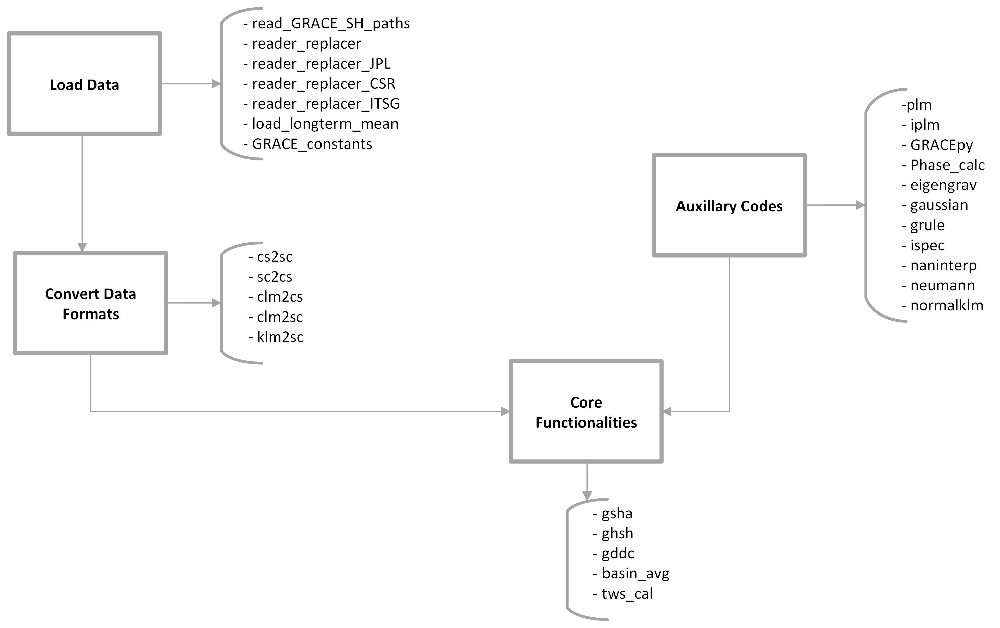
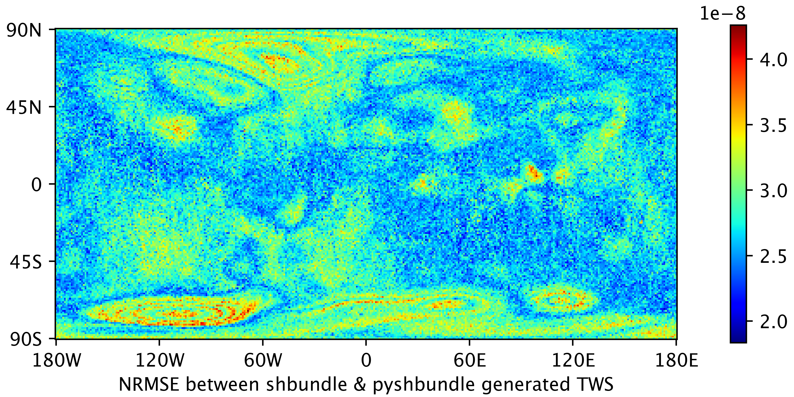
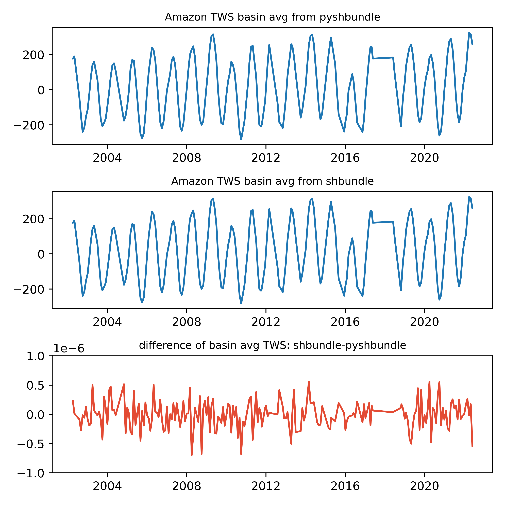
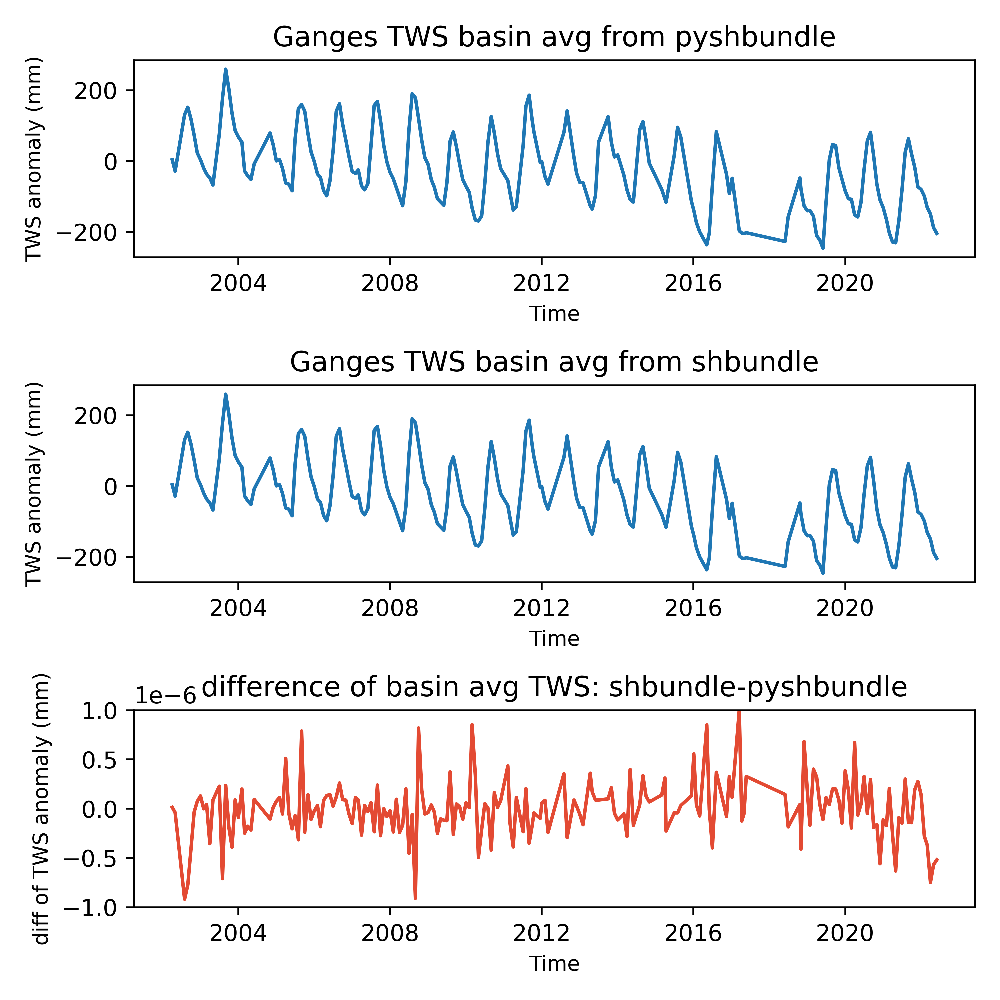
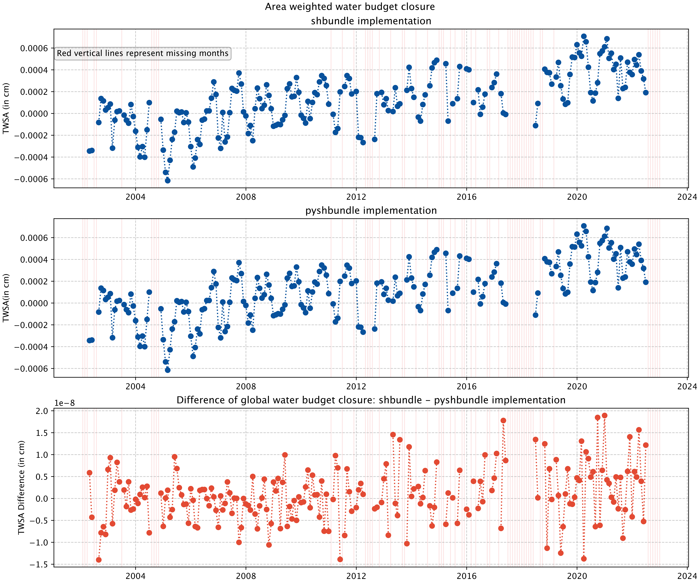

# Summary

`GRACE` or the Gravity Recovery and Climate Experiment1, is a gravimetric satellite mission that can detect the Total Water Storage Anomaly (`TWSA`) in the earth system. The data from the satellite system has been used for various hydrological studies related to groundwater depletion, floods, droughts, etc. GRACE satellite products are typically released in different product levels. In this contribution, we have translated the exisitng matlab codes SHbundle into the python programming language. SHbundle is a Matlab code that converts GRACE level 2 (`L2`) Spherical Harmonics data products into Level 3 (`L3`) `TWSA` products. In addition, a GRACE data driven correction algorithm, firstly coded in Matlab, has also been translated into Python. With this contribution, we hope to enable further work on GRACE data analytics using the Python programming language. Further, we hope to develop synergies within the geodesy community using different programming languages to better collaborate with one-another through this common framework of SHbundle and PySHbundle packages in Matlab and Python programming languages respectively.

# Introduction

GRACE stands for the Gravity Recovery and Climate Experiment, a joint satellite mission by NASA, the National Aeronautics and Space Administration and DLR, the German Aerospace Centre. Some details of the GRACE mission is provided in Table 1.

<i>Table 1: Summary of GRACE satellite mission</i>
| Parameter           |    Details     | 
| -----------------   |:--------------:| 
| Start of Mission    | 17 March 2002  | 
| End of Mission      | 27 October 2017| 
| Inclination         | $89.0 ^ \circ$ | 
| Period              | 94.5 minutes   |  

GRACE consists of two identical satellites orbiting around the earth on the same orbital path. The basic principal of the GRACE satellite operation consists of the monitoring of the intersatellite distance between the twin satellites using microwave pulse measurements [@wahr1998time]. When the satellite system comes across a mass anomaly, each satellite accelerates or decelerates with a phase lag and the intersatellite distance changes. This change in intersatellite distance is later processed to obtain the magnitude of the mass anamoly. When it comes to the continental land surface, the hydrological processes consist of a major component of the mass anamoly over it. However various other signals such as oceanic and atmospheric variations, systemic correlated errors, etc. are also part of the obtained GRACE signals. These unwanted signals and errors necessitate application of various filtering and post-processing techniques. These post-processing steps however also introduce some errors as well as deteorate the qualtiy of the hydrological product [@humphrey2023using]. The hydrological signal estimated after the post-processing steps is the  `total water storage anomaly` (`TWSA`). `TWSA` is the sum of the total water components over a vertical extention of the grid area through the earth. Conventionally, it is represented in terms of the `equivalent water height` (`m`). GRACE has a successor, GRACE-FO, which was successfully launched on 22 May 2018. 

Three different research centres provide GRACE data. These are the University of Texas Center for Space Research (`CSR`), Jet Propulsion Laboratory (`JPL`), and the German Research Center for Geosciences (`GFZ`). Further, GRACE data is available at different levels of processing. `Level 1` data refers to the raw satellite data. These are further available as `Level 1A` and `Level 1B`, based on the level of processsing done to the raw data. `Level 2` are the spherical harmonic coefficients for the geospatial potential estimates. These may be accessed through the JPL's Physical Oceanography Distributed Active Archive Center (`PO.DAAC`)2 or through the Information System and Data Center (`ISDC`)3. `Level 3` consists of mass anomalies or other standardized products, such as the Monthly Ocean/Land Water Equivalent Thickness Surface-Mass Anomaly. Similarly, mass concentration blocks or `mascons` are also availble. These directly provide the `TWSA` over gridded regions, and are available through the three GRACE data centers. More details on the mascon approaches for studying gravity fields and the approaches used by the different data centers for generating mascon products may be referred to in [@antoni2022review]. The mascon products from the various data centers have some differences, attributed to the difference in post-processing steps and corrections applied by the different data centers. An online tool exists developed by the `Colorado Center for Astrodynamics Research` 4. This tool can be used for a quick visualization of the `CSR` and `GSFC` mascon products over all regions of the globe. While the mascon results make application of GRACE data easier to a wider audience, use of `Level 2` data gives the user the freedom and the flexibility to choose their own post-processing algorithms. The choice of application of mascon data product or Level 2 data product may depend upon the purpose of the exercise and the expertise level of the user on the GRACE data post-processing. In this contribtion, we enable the user to obtain the gridded `TWSA` data from `Level 2` data. 

`Level 2` GRACE data products may be stored in various data formats. These include `|C\S|`, `/S|C\`, `clm`, `klm`, vector, and `Colombo` format [@SHbundle]. Our contribution in its current version can handle the `|C\S|`, `/S|C\`,  `clm`, and `klm` data formats. A such, our contribution can be applied using `L2` Spherical Harmonics data from any of the three research centers previously mentioned. In `|C\S|` format, the `Clm` and `Slm` coefficient are stored as lower triangle and upper triangle, respectively, in a matrix of dimention <i>(l + 1) x (l + 1)</i>. In `/S|C\` format, the coefficients are stored in amatrix of dimension <i>(l + 1) x (2 l + 1)</i> with horizontally flipped triangular matrix of `Slm` coefficients on the left half, triangular matrix of `Clm` on the right half, and zeros on the rest of the matrix elements. In our contribution, conversion between the three data formats is made possible with the modules `cs2sc`, `sc2cs`, `clm2sc`, `clm2cs`, and `klm2sc`. 

`Level 3` products are the catchment average hydrological estimates of `TWSA`. These are obtained through the further processing of `Level 2` products. `Level 3` products may further be processed to obtain catchment average timeseries data, labelled as `Level 4` products. Various tools exist in the literature to process GRACE data and to analyze it. Some of these available in the `Matlab` programming language are: `SHbundle` (`Sneew et al., 2021`), GRACE Data Driven Correction (`GDDC`) (`Vishwakarma et al., 2017`), `GRAMAT` (`Feng, 2019`), `SHADE` (`Piretzidis, D., & Sideris, M. G., 2018`), `GRACETOOLS` (`Darbeheshti et al., 2018`), etc. Similarly, some GRACE data processing tools are also available based on the python programming language. These include `gravity-toolkit` `(Sutterley, 2023)`, `ggtools` `(Li, 2020)` and `GRACE-filter` `(Rietbroek, n.a.)`. General tools for spheric harmonic analysis are also available, such as SHTools (`Wieczorek, M. A., & Meschede, M., 2018`). `SHBundle` provides MATLAB-tools for `spheric harmonic synthesis` and `spheric harmonic analysis`. The earliest version of the code were developed in 1994 while the latest version with upgrades can be found dated 2018. `GRAMAT` provides a similar MATLAB-based tools for processing GRACE spherical harmonics data to obtain spatiotemporal global mass variations. The GRAMAT toolbox includes Gaussian smoothening filter to remove North-South stripes, spherical harmonic analysis and synthesis routines, leakage effect reduction routines, harmonic analysis of times series over regions, and uncertainty analysis of GRACE estimates (`Feng, 2019`). `SHADE` provides a matlab-based toolbox for the empirical de-correlation of GRACE monthly spherical harmonics (`Piretzidis, D., & Sideris, M. G., 2018`). `Gravity-toolkit` is a python-based package meant to handle GRACE L2 data products. Its functionalities include visualization of GRACE and GRACE-FO L2 data products, and the estimation of GRACE and GRACE-FO L2 data product errors. `Gg-tools` too contain similar tools for signal correction and for conversion of GRACE L2 products to L3. `GRACE-filter` provides tool for filtering of GRACE L2 product using DDK filter based on `Kusche et al. (2009)`.
 
# Statement of need
A MATLAB code bundle already exists called `SHbundle` developed by `Sneew et al. (2021)` and distributed under the GNU license. The code bundle can be freely used and modified by anyone giving proper credit to the original developers. However, MATLAB being a proprietary software may have some limitations in terms of accessibility. <i>`Brief description of impact of SHBundle package here`</i> 

On the other hand, a strong community of programmers also exists for Python, an open-source programming language. In this contribution, we have translated the MATLAB codes from the SHbundle into the Python programming language. In addition to the SHBundle codes, we have further translated the `GRACE Data Driven Correction (GDDC)` codes from Matlab to Python. `GDDC` allows the correction of filtered GRACE `Level 2` products and restore the signal loss, independent of the catchment size `(Vishwakarma et al., 2017)`. 
It is hoped the contribution will make GRACE L2 data processing more accessible to a wider audience of programmers. Our python package is titled `PySHbundle` and the working code can be accessed in GitHub : [https://github.com/mn5hk/pyshbundle](https://github.com/mn5hk/pyshbundle)

# Mathematic Backround

GRACE works on the principal of gravimetric changes. Level 2 GRACE data consists of the spherical harmonic coefficients  <i>$C_{l,m}$</i> and <i>$S_{l,m}$</i>. Gravimetric potential function <i>V ( r, θ, λ )</i> can be represented by the spherical harmonic coefficients in the frequency domain with the help of the following relation `(Vishwakarma, 2017; Kaula, 1996; Chao & Gross, 1987; Wahr et. al., 1998)`:

 
\begin{equation}
    V(r, \theta, \lambda) = 
    \frac{GM}{r} \sum_{l=0} ^ {\infty} 
    \left(\frac{a}{r}\right) ^ {l}
    \sum_{m=0} ^ {l} 
    \bar{P}_{l,m}(\cos \theta)[C_{l,m}\cos m\lambda+S_{l,m}\sin m\lambda],
\end{equation} 

where <i>G</i> is the Gravitational constant, <i>M</i> represents the total Earth mass, <i>a</i> is the average radius of the Earth, <i>$P_{l,m}$</i>  represents the the fully normalized Legendre functions of the first kind, <i>$C_{l,m}$</i> and <i>$S_{l,m}$</i> represent the fully normalized spherical harmonic coefficients, and <i>l</i> and <i>m</i> represent the degree and order, respectively.

It should be noted that <i>equation 1</i> does not deal with the variability of gravimetric potential function over time. However, a major application of the GRACE satellite system is to retrieve the time-variable gravity information. This is acheived by taking the variation of the spherical harmonic coefficients over time. To obtain this, a long-term mean of the monthly values of the spherical harmonic coefficients is removed from the monthly spherical harmonic coefficients obtained from GRACE L2 data. This can be denoted by <i>$\Delta C_{l,m}$</i> and <i>$\Delta P_{l,m}$</i>. Thus, <i>equation 1</i> can be modified to obtain the change in gravimetric potential function over time.

Since we are interested in the change in mass in our system, we need to obtain the change in density from the change in gravity potential function. It is further assumed that the redistribution of the mass of the earth takes place within a thin layer close to the surface of the Earth. Furthermore, this mass redistribution takes place with a deformation. The mass deformation is accounted for by the load Love numbers <i>kl</i> `(Wahr et. al., 1998)`. As such, <i>equation 1</i> further resolves to:

\begin{equation}
    \Delta \sigma (\theta, \lambda) = 
    \frac{a \rho_{avg}}{3} \sum_{l=0} ^ {\infty} 
    \sum_{m=0} ^ {l} 
    \bar{P}_{l,m}(\cos \theta)
    \frac{2 l + 1}{1 + k_{l}}
    [\Delta C_{l,m}\cos m\lambda+ \Delta S_{l,m}\sin m\lambda],
\end{equation}

Here, <i>$\Delta \sigma (\theta, \lambda)$</i> represents the change in surface density of the Earth, and <i>$\rho_{avg}$</i> represents the average density of the Earth (<i>5517 kg / m3</i>). As the mass redistribution on Earth over a monthly time scale is dominated by the hydroogical processes, the density change <i>$\Delta \sigma (\theta, \lambda)$</i> relates to the <i>Equivalent Water Height (EWH)</i> by: <i>$\Delta \sigma (\theta, \lambda) = EWH (\theta, \lambda) . \rho_{water}$</i>. Thus, <i>equation 2</i> can be rewritten in terms of <i>EWH</i> as:

\begin{equation}
    EWH (\theta, \lambda) = 
    \frac{a \rho_{avg}}{3 \rho_{water}} 
    \sum_{l, m}
    \bar{P}_{l,m}(\cos \theta)
    \frac{2 l + 1}{1 + k_{l}}
    [\Delta C_{l,m}\cos m\lambda+ \Delta S_{l,m}\sin m\lambda],
\end{equation}

Thus, we can obtain the hydrological parameter <i>EWH</i> from GRACE Level 2 data using <i>equation 3</i>. The accuracy and precision of the <i>EWH</i> computed depends upon the accuracy and precision of the <i>$\Delta C_{l,m}$</i> and <i>$\Delta P_{l,m}$</i>, obtained from GRACE. However, these GRACE products are both noisy and coarse in resolution `(Wahr et. al., 1998)`. A tradeoff exists between the noise and resolution of the spherical harmonic products. To capture the spherical harmonic products at a higher spatial resolution, their values at higher degree and order needs to be used. However, noise increases with the increase in degree and order, making the computed <i>EWH</i> also noisy. Similarly, if the spherical harmonics are truncated at a lower degree and order, the noise in the computed <i>EWH</i> decreases, however, the spatial resolution of the obtained <i>EWH</i> also reduces.

To improve the signal-to-noise ratio of the obtained <i>EWH</i>, various filtering techniques have been used. An ideal filter retains all of the signal while filtering out all of the noise. A popular filter used for GRACE applications is the Gaussian filter. The weights, <i>w</i>, for the Gaussian spatial averaging is given by:

\begin{equation}
    \omega (\psi) = 
    \frac{\beta}{2 \pi} 
    \frac{exp [-\beta (1 - \cos \psi)]}{1 - \exp ^ {-2 \beta}},
\end{equation}

where, $\beta = \frac{\ln (2)}{(1 - \cos(\frac{r_{fil}}{a}))}$. Here, $r_{fil}$ is the averaging radius of the filter. Thus, the Gaussian filter obtained in the spectral domain is written as `(Wahr et. a., 1998)`:

\begin{equation}
\bar{\sigma}(\theta, \lambda) = 
\frac{2 a \rho_{avg} \pi}{3} 
    \sum_{l, m} W_l
    \bar{P}_{l,m}(\cos \theta)
    \frac{2 l + 1}{1 + k_{l}}
    [\Delta C_{l,m}\cos m\lambda+ \Delta S_{l,m}\sin m\lambda],
\end{equation}

<i>Equation 5</i> is similar to <i>equation 3</i>, but for an additional multiplication factor, <i>$W_l$</i>, defined as <i>$W_l = \int_0^\pi w (\psi) P_l (\cos \psi) \sin \psi d\psi$</i> and <i>$P_l = \frac{\bar{P_l}}{\sqrt {2l + 1}}$</i>. <i>Equation 5</i> defines a Gaussian filter that decays with only degree. However, for our GRACE spherical harmonics, the decay occurs with the location as well as with the degrees and orders. Thus, <i>equation 5</i> is further generalized as `(Wahr et. al., 1998; Devaraju, 2015)`:

\begin{equation}
\bar{\sigma}(\theta, \lambda) = 
\frac{a \rho_{avg}}{12 \pi} 
    \sum_{l, m}
    \sum_{n, k} W_{lm}^{nk}
    \bar{P}_{l,m}(\cos \theta)
    \frac{2 l + 1}{1 + k_{l}}
    [\Delta C_{l,m}\cos m\lambda+ \Delta S_{l,m}\sin m\lambda],
\end{equation}

where <i>$W_{lm}^{nk}$</i> represents the spectral weight in its general form. <i>Equation 6</i> is the final result we obtain after spectral harmonic analysis and application of Gaussian filter. More details on the mathematical description presented in this section can be referred to in `Vishwakarma (2017)`.

# Methodology

In this contribution, tools to implement the spherical harmonic analysis and filtering application has been developed in the python programming language. In addition, complementary analytical tools such as spherical harmonic synthesis and GRACE data driven correction have also been included. To achieve this, we have implemented the preexisting matlab codes `SHbundle` into the python programming language. More details on the `SHbundle` package may be refered to at `Sneew et al. (2021)`. In addition, `GRACE Data Driven Corrections` algorithm `(Vishwakarma et. al., 2017)` has also been translated from matlab to python. The naming of the modules and the workflow between the modules has been preserved as much as possible in the `PySHbundle` python implementation. This is to ensure smooth communication between user communitities of the two packages and/or the two different programming language communities. Further, our code has been tested using the `SHbundle` implementation results for validation.

# Implementation
A schematic diagram of the code workflow is presented in the Fig 01.  
{ width=50% } 
<i>Fig 01: Schematic Diagram of the Code Workflow</i> 

The module codes can be categorized into four categories: load data, convert data formats, core functionality and auxillary codes. The <i>load data</i> codes can read data from either of the `JPL`, `ITSG` or `CSR` GRACE data centers. The codes further performs the necessary preprocessing, including the conversion of data formats, replacement of some Legendre coefficients as well as removing the longterm mean. The <i>convert data format</i> codes can convert `L2` GRACE Spherical Harmonics data from one format to another. These codes are invoked by the  <i>load data</i> codes for data format conversion. Further, these codes can be independently invoked as well by the user for their needs.

The `core functionalities` of the module are the `gsha`, `gshs`, `gddc`, `tws_cal`, and `basin_avg` codes. `GSHA` module inputs the GRACE L2 spherical harmonic coefficients and performs the `GRACE Spherical Harmonics Analysis (GSHA)` algorithm. The algorithm converts the input L2 spherical harmonic coefficients into gridded values at the user-desired grid resolution. An inverse module is also provided, called the `gshs.py` module. This module performs the `GRACE Spherical Harmonics Synthesis (GSHS)` algorithm. The algorithm converts the gridded `TWSA` values into the GRACE L2 spherical harmonics coefficients. In addition to the translation of the `SHbundle` matlab package, this contribution further includes the GRACE Data Driven Correction function, detailed and first coded in matlab in `Vishwakarma et al.  (2017)`. The implementation is done via the `gddc` module. More details on the `gddc` implementation can be refered to in the paper cited above. `tws_cal ` computes the total water storage values at each grid from the GRACE L2 spherical harmonics by first applying the `Gaussian filter` on the L2 data products, and then calling the `gshs` module. `basin_avg` module computes the `L4` GRACE basin average timeseries product, for any basin input by the user as a GIS shapefile. 

The rest of the codes are bundled together as <i>auxillary codes</i> in Fig 01. An important part of the `GSHS` algorithm implementation is the implementation of the `PLM` algorithm. The `PLM` algorithm inputs degree, order and co-latitude values and computes the Legendre functions. The `plm.py` module can also provide the first and second derivatives of the Legendre functions. The implementation of the integrals of the Legendre functions is also done; this is available through the `iplm.py` module. `IPLM` inputs the degree, order and co-latitude, and returns the integrated Legendre functions. 

Some important modules for the spherical harmonic synthesis step are `normalklm`, `eigengrav`, and `ispec`. `normalklm.py` returns the hydrostatic equilibrium ellipsoid for the earth surface based on `Lambeck (1988) "Geophysical Geodesy", p.18`. `eigengrav.py` provides the isotrophic spectral transfer to obtain the equivalent water thickness (m). Lastly, `ispec.py` inputs the sine and cosine coefficients and returns the field function `F`.  

The `Global Spherical Harmonic Analysis` code depends upon `neumann` along with the `IPLM` and `sc2cs`. `neumann.py` returns the weights and nodes for Neumann's numerical integration scheme on the sphere. The `gshs.py` code provides options for spehrical harmonic synthesis to compute the sine and cosine components of the Legendre function. These include `least squares`, `weighted least squares`, `approximate quadrature`, `first neumann method`, `second neumann method` and `block mean values`. The `neumann.py` code is required for the implementation of the `first neumann method` and `second neumann method`. 

 

# Validation
The results of the PySHbundle TWS computation has been validated with respect to TWS computation using SHbundle and presented in Fig 02. The NRMSE values are in the order of e-8. Timeseries plots for the Amazon and the Ganges basins have been plotted in Fig 03 and Fig 04, respectively. In both the cases, the order of magnitude of the signal is e2, while the error is in the order of e-6. Additionally, water budget closure timeseries for the world is provided in Fig 05. The magnitude of difference between the errors and the signal is of the order e-4. As such, the errors are likely computational artifacts; and of very small order that can be neglected. Thus, the python package PySHbundle is deemed to give the desired performance in the processing of GRACE L2 Spherical Harmonics to obtain L3 TWS anomalies over land grids.
 
<i>Fig 02: RMSE and NRMSE of TWS computation for PySHbundle with respect to SHbundle results.</i> 

 
<i>Fig 03: Timeseries plot of TWS signal from pyshbundle, shbundle and error signal for the Amazon basin</i> 

 
<i>Fig 04: Timeseries plot of TWS signal from pyshbundle, shbundle and error signal for the Ganges basin</i> 

 
<i>Fig 05: Water budget closure timeseries plot of TWS signal from pyshbundle, shbundle and error signal</i> 

# References

